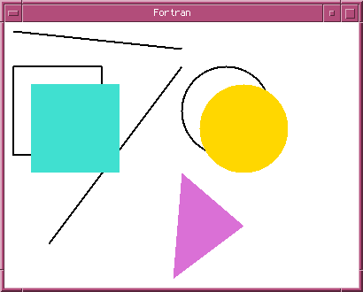

# f03xlib
An ISO C binding interface to Xlib for Fortran 2003/2008/2018. Currently, only a
subset of Xlib is implemented. In order to work with XPM files, an interface to
`libxpm` is provided by `xpm.f90`.

## Build
You can use BSD make (`bmake` on Linux) to compile everything. Build the Xlib
interface with:
```
$ make xlib
```
Or run your favourite Fortran compiler directly:
```
$ gfortran8 -c xlib.f90
```

Build the XPM interface with:
```
$ make xpm
```

## Examples


Example programmes utilising the interface can be found in the directory `examples`:

* **drawing** draws some shapes on the window.
* **events** captures X11 events.
* **image** loads and displays an XPM image with transparency.
* **mandelbrot** draws a Mandelbrot set.
* **raycaster** projects a 2-D map into 3-D.
* **starfield** flys through a starfield.
* **text** outputs coloured text.
* **window** displays a simple window.
* **wireframe** renders a wire-frame model of a Tie Fighter.

Build them with `make <name>`. Without BSD make, compile the examples manually,
for instance:
```
$ gfortran8 -Wl,-rpath=/usr/local/lib/gcc8/ -I/usr/local/include/ -L/usr/local/lib/ \
  -o window examples/window/window.f90 xlib.o -lX11
```

## Licence
ISC
